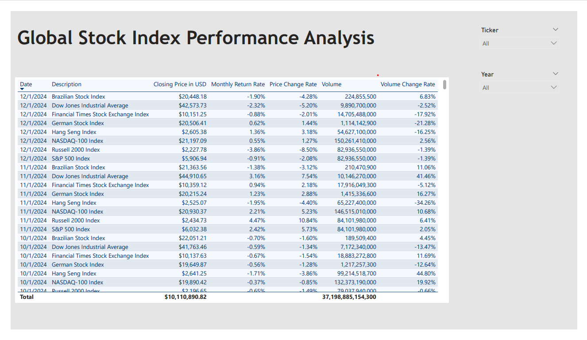
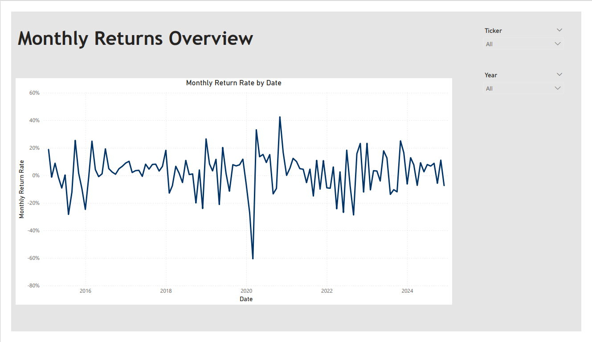
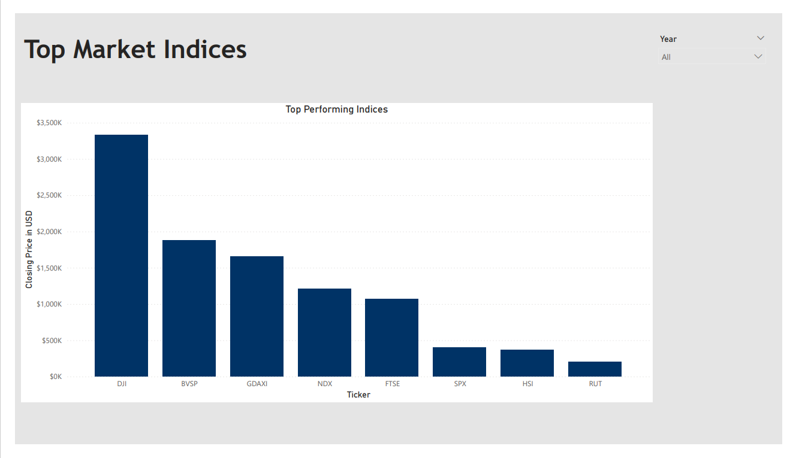
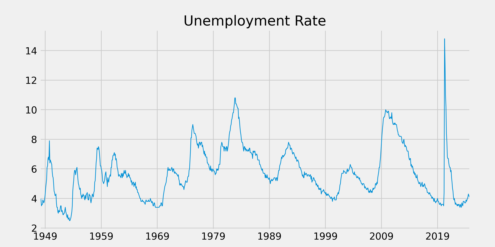
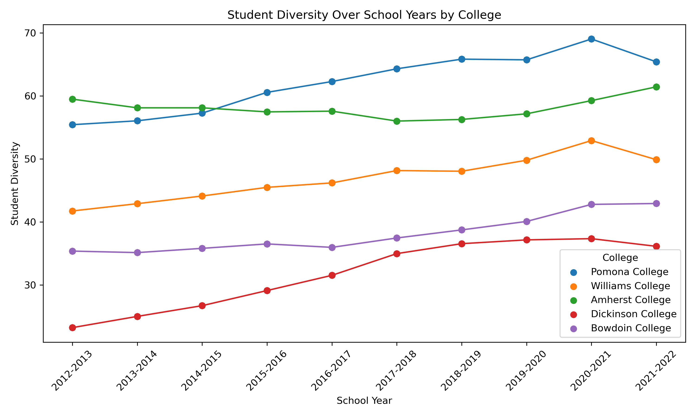

**Welcome!**  
This is my professional portfolio, showcasing my resume, projects, and online profiles.

---

    

---

## Resume
[View My Resume](./Ella_Batdelger_CV.pdf)

---

## Recent Projects
### 1.[Global Stock Index Analysis Project](./Global%20Stock%20Index%20Analysis%20Project/)

    

This project analyzes data from major global stock indices using SQL, Python, and Power BI. Automated data retrieval from Yahoo Finance, calculated key metrics, and created interactive dashboards to visualize trends and performance.

[Explore Project →](https://github.com/EllaBatdelger/EllaBatdelger.github.io/tree/main/Global%20Stock%20Index%20Analysis%20Project)

### 2. [Economic Analysis Project](./Economic%20Analysis%20Project/)

    

This project aims to analyze U.S. unemployment trends using data from the FRED API, combined with web scraping and visualization techniques. This project highlights data cleaning, exploratory analysis, and the creation of interactive charts to reveal key insights.

[Explore Project →](https://github.com/ellabatdelger/portfolio/tree/main/Economic%20Analysis%20Project)

### 3. [College Diversity Score Prediction](./College%20Diversity%20Score%20Prediction%20Project/)

    
    

This project analyzes and predicts diversity scores for U.S. universities, focusing on student and professor diversity. Using machine learning models and data analysis with Python libraries (like Pandas, NumPy, and Scikit-learn), we provide insights into diversity trends at National Universities and Liberal Arts Colleges.

[Explore Project →](https://github.com/EllaBatdelger/EllaBatdelger.github.io/tree/main/College%20Diversity%20Score%20Prediction%20Project)

---

## Relevant Links
- [GitHub](https://github.com/ellabatdelger)
- [LinkedIn](https://www.linkedin.com/in/ella-batdelger-796644167/)

